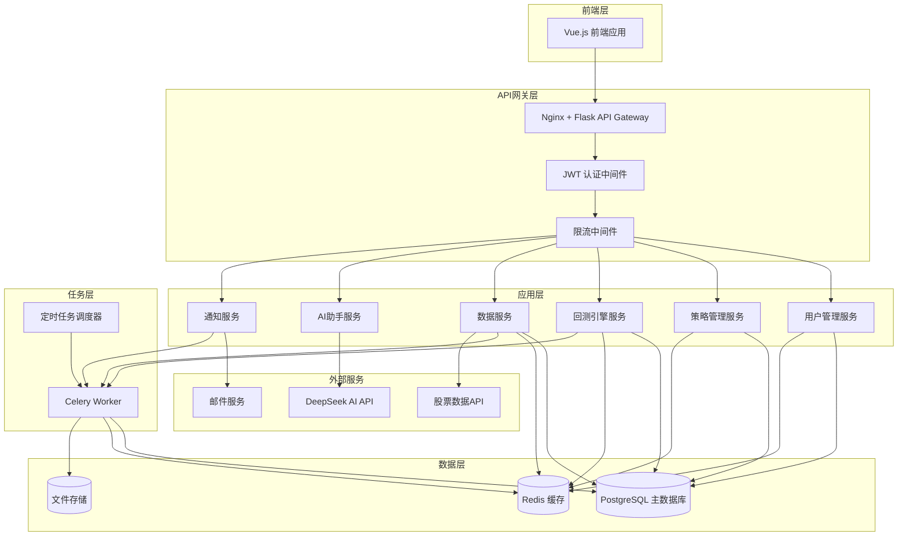

# 量化交易平台后端架构设计文档

## 📋 项目概述

基于Flask框架构建的量化AI股票策略平台后端系统，支持策略管理、回测分析、数据服务、AI助手等核心功能。

### 技术栈
- **Web框架**: Flask + Flask-RESTful
- **数据库**: PostgreSQL (主库) + Redis (缓存/消息队列)
- **ORM**: SQLAlchemy
- **任务队列**: Celery
- **定时任务**: APScheduler
- **API文档**: Flask-RESTX (Swagger)
- **认证**: JWT + Flask-JWT-Extended
- **数据获取**: akshare, yfinance
- **AI集成**: DeepSeek API

## 🏗️ 系统架构图



## 📦 功能模块设计

### 1. 用户认证模块 (Auth Module)
- **功能**: 用户注册、登录、权限管理
- **核心组件**: JWT认证、密码加密、权限控制
- **数据模型**: User, Role, Permission

### 2. 策略管理模块 (Strategy Module)
- **功能**: 策略CRUD、代码编辑、版本控制、策略执行
- **核心组件**: 策略编译器、代码安全检查、版本管理
- **数据模型**: Strategy, StrategyVersion, StrategyExecution

### 3. 回测系统模块 (Backtest Module)
- **功能**: 回测任务管理、性能分析、结果可视化
- **核心组件**: 回测引擎、性能计算器、风险分析
- **数据模型**: BacktestTask, BacktestResult, PerformanceMetrics

### 4. 数据服务模块 (Data Module)
- **功能**: 股票数据获取、存储、处理、缓存
- **核心组件**: 数据采集器、数据清洗、实时数据流
- **数据模型**: StockData, MarketData, TechnicalIndicator

### 5. AI助手模块 (AI Module)
- **功能**: 智能对话、策略分析、投资建议
- **核心组件**: DeepSeek集成、对话管理、知识库
- **数据模型**: Conversation, Message, AIResponse

### 6. 通知系统模块 (Notification Module)
- **功能**: 实时通知、邮件提醒、调仓信号
- **核心组件**: 消息队列、通知推送、模板引擎
- **数据模型**: Notification, NotificationTemplate, UserNotificationSetting

### 7. 文件管理模块 (File Module)
- **功能**: 文件上传、下载、存储管理
- **核心组件**: 文件上传处理、云存储集成
- **数据模型**: FileRecord, FileCategory

## 🔗 API接口设计

### 认证相关接口
```
POST   /api/auth/register        # 用户注册
POST   /api/auth/login           # 用户登录
POST   /api/auth/logout          # 用户登出
POST   /api/auth/refresh         # 刷新Token
GET    /api/auth/profile         # 获取用户信息
PUT    /api/auth/profile         # 更新用户信息
POST   /api/auth/change-password # 修改密码
POST   /api/auth/reset-password  # 重置密码
```

### 策略管理接口
```
GET    /api/strategies           # 获取策略列表
POST   /api/strategies           # 创建新策略
GET    /api/strategies/{id}      # 获取策略详情
PUT    /api/strategies/{id}      # 更新策略
DELETE /api/strategies/{id}      # 删除策略
POST   /api/strategies/{id}/copy # 复制策略
GET    /api/strategies/{id}/versions # 获取策略版本
POST   /api/strategies/{id}/run  # 运行策略
POST   /api/strategies/{id}/stop # 停止策略
GET    /api/strategies/{id}/logs # 获取策略日志
```

### 回测系统接口
```
GET    /api/backtests            # 获取回测列表
POST   /api/backtests            # 创建回测任务
GET    /api/backtests/{id}       # 获取回测详情
DELETE /api/backtests/{id}       # 删除回测
GET    /api/backtests/{id}/result # 获取回测结果
GET    /api/backtests/{id}/metrics # 获取性能指标
GET    /api/backtests/{id}/report # 获取回测报告
POST   /api/backtests/{id}/export # 导出回测结果
```

### 数据服务接口
```
GET    /api/data/stocks          # 获取股票列表
GET    /api/data/stocks/{symbol} # 获取股票详情
GET    /api/data/stocks/{symbol}/price # 获取股票价格
GET    /api/data/stocks/{symbol}/history # 获取历史数据
GET    /api/data/stocks/{symbol}/indicators # 获取技术指标
GET    /api/data/market/indices  # 获取市场指数
GET    /api/data/market/sectors  # 获取行业板块
POST   /api/data/watchlist       # 添加自选股
GET    /api/data/watchlist       # 获取自选股
DELETE /api/data/watchlist/{symbol} # 删除自选股
```

### AI助手接口
```
GET    /api/ai/conversations     # 获取对话列表
POST   /api/ai/conversations     # 创建新对话
GET    /api/ai/conversations/{id} # 获取对话详情
POST   /api/ai/conversations/{id}/messages # 发送消息
DELETE /api/ai/conversations/{id} # 删除对话
POST   /api/ai/analyze-strategy  # AI策略分析
POST   /api/ai/investment-advice # 获取投资建议
```

### 通知系统接口
```
GET    /api/notifications        # 获取通知列表
POST   /api/notifications/mark-read # 标记已读
DELETE /api/notifications/{id}   # 删除通知
GET    /api/notifications/settings # 获取通知设置
PUT    /api/notifications/settings # 更新通知设置
POST   /api/notifications/test   # 测试通知
```

### 文件管理接口
```
POST   /api/files/upload         # 文件上传
GET    /api/files/{id}           # 文件下载
DELETE /api/files/{id}           # 删除文件
GET    /api/files                # 获取文件列表
```

## 🗄️ 数据库设计

### 核心数据表

#### 用户相关表
```sql
-- 用户表
users (
    id, username, email, password_hash, 
    full_name, avatar_url, phone, 
    is_active, created_at, updated_at
)

-- 角色表
roles (
    id, name, description, permissions, 
    created_at, updated_at
)

-- 用户角色关联表
user_roles (
    user_id, role_id, created_at
)
```

#### 策略相关表
```sql
-- 策略表
strategies (
    id, user_id, name, description, 
    code, language, status, category,
    risk_level, created_at, updated_at
)

-- 策略版本表
strategy_versions (
    id, strategy_id, version, code, 
    changelog, created_at
)

-- 策略执行记录表
strategy_executions (
    id, strategy_id, status, start_time, 
    end_time, profit_loss, logs
)
```

#### 回测相关表
```sql
-- 回测任务表
backtest_tasks (
    id, user_id, strategy_id, name,
    start_date, end_date, initial_capital,
    benchmark, status, created_at
)

-- 回测结果表
backtest_results (
    id, task_id, final_value, total_return,
    annual_return, sharpe_ratio, max_drawdown,
    win_rate, trades_count, created_at
)

-- 回测交易记录表
backtest_trades (
    id, result_id, symbol, action, 
    quantity, price, timestamp, profit_loss
)
```

#### 数据相关表
```sql
-- 股票基本信息表
stocks (
    symbol, name, exchange, sector, 
    industry, market_cap, created_at, updated_at
)

-- 股票价格数据表
stock_prices (
    id, symbol, date, open, high, low, 
    close, volume, adj_close
)

-- 技术指标表
technical_indicators (
    id, symbol, date, indicator_type,
    value, parameters
)
```

## ⚙️ 系统配置

### 环境配置
```python
# config.py
class Config:
    # 基础配置
    SECRET_KEY = os.environ.get('SECRET_KEY')
    
    # 数据库配置
    SQLALCHEMY_DATABASE_URI = os.environ.get('DATABASE_URL')
    SQLALCHEMY_TRACK_MODIFICATIONS = False
    
    # Redis配置
    REDIS_URL = os.environ.get('REDIS_URL')
    
    # JWT配置
    JWT_SECRET_KEY = os.environ.get('JWT_SECRET_KEY')
    JWT_ACCESS_TOKEN_EXPIRES = timedelta(hours=1)
    JWT_REFRESH_TOKEN_EXPIRES = timedelta(days=30)
    
    # Celery配置
    CELERY_BROKER_URL = os.environ.get('REDIS_URL')
    CELERY_RESULT_BACKEND = os.environ.get('REDIS_URL')
    
    # AI配置
    DEEPSEEK_API_KEY = os.environ.get('DEEPSEEK_API_KEY')
    DEEPSEEK_API_URL = 'https://api.deepseek.com'
    
    # 文件存储配置
    UPLOAD_FOLDER = 'uploads'
    MAX_CONTENT_LENGTH = 16 * 1024 * 1024  # 16MB
```

## 🔒 安全设计

### 1. 认证安全
- JWT双Token机制 (Access + Refresh)
- 密码BCrypt加密
- 登录失败限制
- Session管理

### 2. API安全
- CORS跨域控制
- 请求频率限制
- 参数验证与过滤
- SQL注入防护

### 3. 代码安全
- 策略代码沙箱执行
- 危险函数黑名单
- 代码静态分析
- 资源使用限制

### 4. 数据安全
- 敏感数据加密
- 数据备份策略
- 访问日志记录
- 权限分级控制

## 📊 性能优化

### 1. 缓存策略
- Redis缓存热点数据
- 数据库查询缓存
- API响应缓存
- 静态资源CDN

### 2. 数据库优化
- 索引优化
- 分页查询
- 连接池配置
- 读写分离

### 3. 异步处理
- Celery异步任务
- 批量数据处理
- 后台定时任务
- 消息队列

## 🚀 部署架构

### 1. 容器化部署
```yaml
# docker-compose.yml
services:
  web:
    build: .
    ports:
      - "5000:5000"
    depends_on:
      - db
      - redis
  
  db:
    image: postgres:13
    environment:
      POSTGRES_DB: quant_trading
  
  redis:
    image: redis:6-alpine
  
  celery:
    build: .
    command: celery worker
    depends_on:
      - db
      - redis
```

### 2. 负载均衡
- Nginx反向代理
- 多实例部署
- 健康检查
- 故障转移

### 3. 监控日志
- 应用性能监控
- 错误日志收集
- 业务指标统计
- 告警通知

## 📈 扩展规划

### 1. 微服务改造
- 服务拆分策略
- API网关集成
- 服务发现
- 配置中心

### 2. 大数据支持
- 数据仓库建设
- 实时数据流
- 机器学习平台
- 量化因子库

### 3. 功能扩展
- 期货/期权支持
- 量化研究平台
- 社区功能
- 移动端支持

---

## 📝 开发计划

### Phase 1: 基础架构 (2-3周)
- [x] 项目初始化
- [ ] 数据库设计
- [ ] 基础API框架
- [ ] 用户认证系统

### Phase 2: 核心功能 (4-5周)
- [ ] 策略管理系统
- [ ] 数据服务系统
- [ ] 回测引擎核心
- [ ] 基础前端集成

### Phase 3: 高级功能 (3-4周)
- [ ] AI助手集成
- [ ] 通知系统
- [ ] 性能优化
- [ ] 安全加固

### Phase 4: 部署上线 (1-2周)
- [ ] 容器化部署
- [ ] 监控告警
- [ ] 文档完善
- [ ] 测试验收

---

> 💡 **注意**: 此文档为设计阶段文档，具体实现细节将在开发过程中不断完善和调整。
